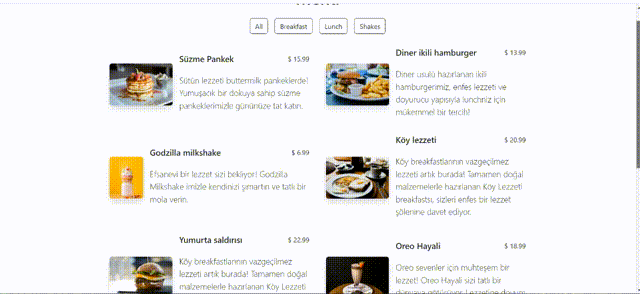

<h1> MENU PROJECT </h1>

<h2>This is a menu project created by Html, Css and Javascript. </h2>

The datas of the products are taken from another js page.

There are four group of products you can choose from the menu.

You can click all, breakfast, lunch and shakes buttons to see the related group of items.

The project is also responsive for small screens.

<h2>Screen </h2>

